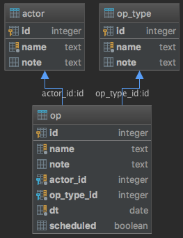

Information system of actors, operation types and operations,
generates an optimal schedule of operation and evaluates its metrics.

### Functions
* generate an optimal schedule of operations
* evaluate metrics of the schedule
* extract schedule
* update a list of operations
* create, get all, get by id, update, delete by id actor, operation type, operation

### Database
  
[SQLite database schema](src/main/resources/schema.sql)  
Taking into consideration a very small number of database objects it was 
decided to use JDBC and connection pool to increase performance instead 
of Spring Data or any other ORM framework.
The system is intended to have only one user who modifies the data and 
not a big number of readers, thus SQLite was selected as database 
engine.

### Optimisation
It is assumed there is a constraint that only one actor may conduct a 
given operation on a certain day. Therefore there is a problem to find a 
uniform distribution of operations among actors.
The optimisation process consists of finding all possible schedules and 
selecting one with minimum mean deviation of operation count per actor 
from its mean value.

### Technologies and tools
* Java 8
* SQLite
* JDBC
* Apache DBCP (connection pooling framework)
* Spring framework (Boot, Web/MVC, Test)
* Apache log4j
* Maven
* Git
* IntelliJ IDEA
* Insomnia REST Client
* SQLite Studio
* REST API

### Future improvements
* add authentication and authorization layer, probably utilising Spring Security or simply BCrypt
* prevent too many requests per time unit
* handle concurrent requests properly
* devise an approximate, heuristic solution
* apply a continuous integration tool to the repository
* manage database backup
* design UI, probably using React framework
* provide performance benchmarks